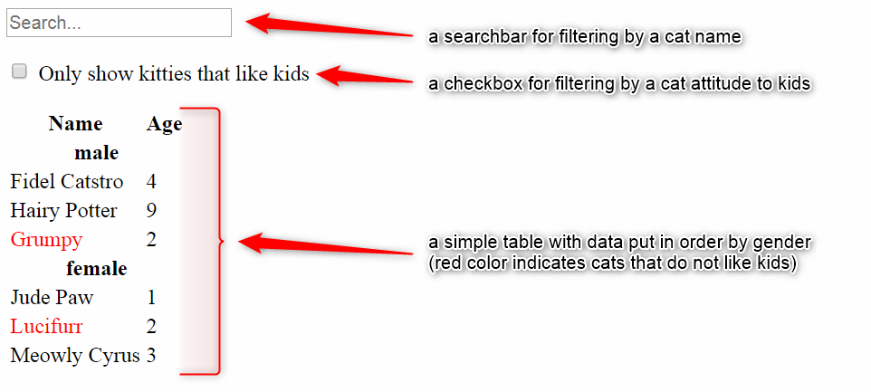

## Cat Shelter App

The workshop goal was to learn how to:
* divide the project to smaller React Components;
* decide which Components should have constructor and which should not;
* pass information from child Components to the parent Component; 
* handle events correctly.

The workshop is based on a very simple table. There is no style inserted as the workshop main purpose was improving the logic. 
The picture shows how it works.

